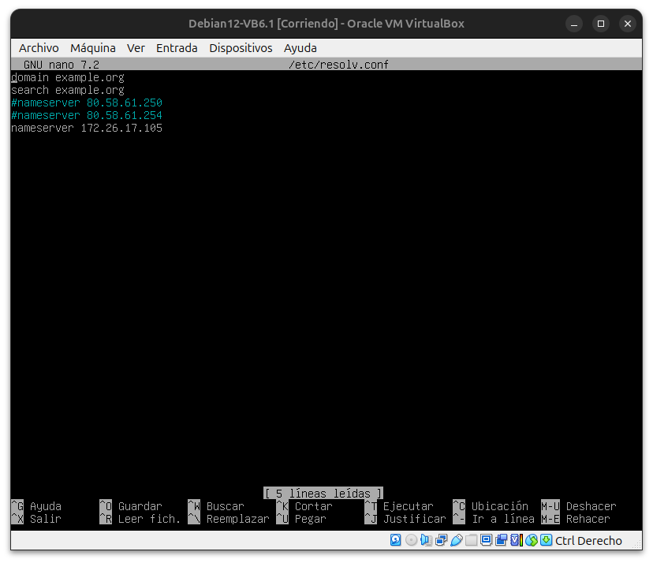
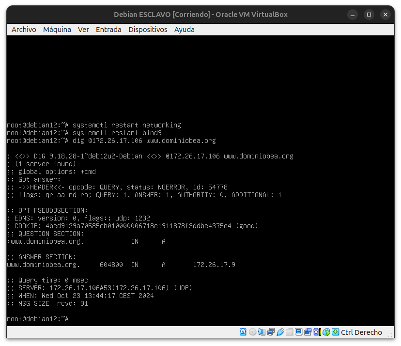

# CONFIGURACIÓN DE UN SERVIDOR DNS MAESTRO

Queremos configurar un DNS.

Para ello primero debemos tener instalado bind9.

Una vez hecho esto, entramos al archivo **/etc/bind/named.conf.local**.  

Ahí añadimos lo siguiente:

  

Creamos la primera zona con el nombre de nuestro dominio, tipo master porque es el principal y la ruta de bind, añadiendo db. y el nombre del dominio.

La siguiente zona es OPCIONAL (por eso está comentada) esta vez lleva de nombre la red al revés + .in-addr.arpa, en este caso sería 26.172.in-addr.arpa.

A continuación, queremos volcar lo que hay en el archivo **/etc/bind/db.local** en un archivo de nuestro dominio, para modificarlo: **cp /etc/bind/db.local /etc/bind/db.dominiobea.org**

Ahora hay que configurar el archivo para los registros de las zonas.

Añado $ORIGIN y el nombre de mi dominio, en este caso dominiobea.org.

Donde pone ns tengo que poner la ip de mi máquina.

Tengo que cambiar también el nombre donde pone SDA.

Quito el @ que había antes del IN NS.

Restauro el servicio con systemctl restart bind9.

Hago un dig @ip de mi máquina y para probar que va todo bien [www.nombrededominio](http://www.nombrededominio)

Quedaría: dig @172.26.16.10 www.dominiobea.org  

Ahora vamos a configurarlo a la inversa.

Volvemos a abrir el archivo **/etc/bind/named.conf.local** y descomentamos las líneas. 

En el archivo **/etc/resolv.conf** hay que añadir nameserver y la ip: nameserver 172.26.17.105

Hecho esto ya tiene que salir.

# CONFIGURACIÓN DE UN SERVIDOR DNS ESCLAVO

Creamos una máquina Debian nueva.

Entramos en el archivo **/etc/bind/named.conf.options**, dejamos la misma configuración que en el maestro y añadimos **notify no;**.

En el archivo /etc/bind/named.conf.local y añadimos la configuración.

